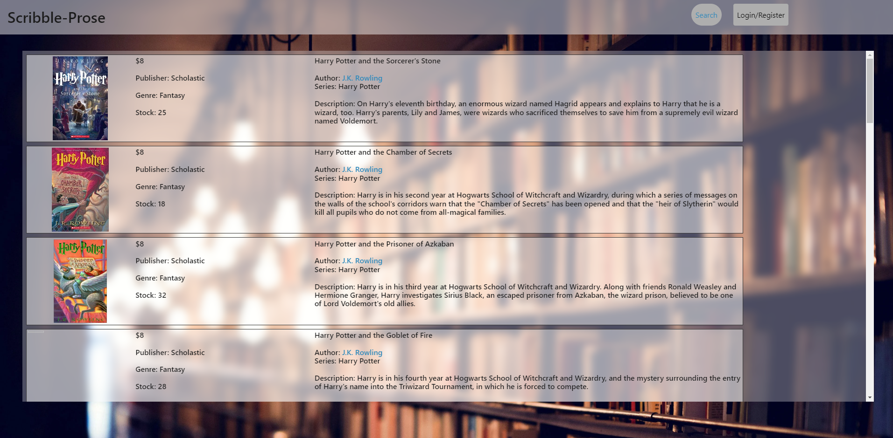
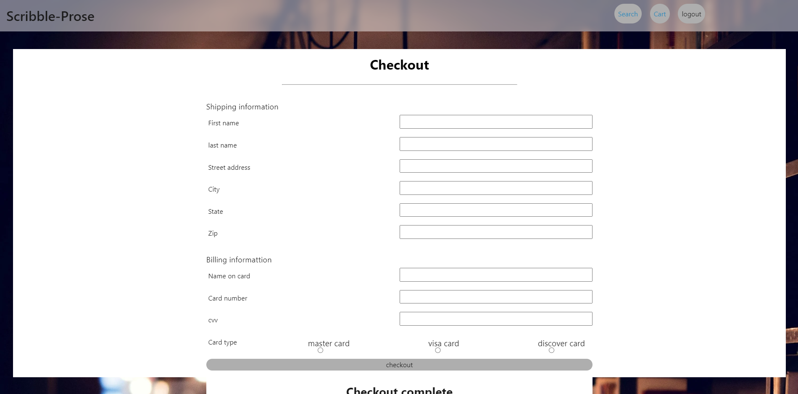

# redesigned-succotash

## Table of contents

* [Description](#Description)
* [Technologies](#Technologies)
* [Picture Refs](#Picture-Refs)
* [Authors](#Authors)
* [License](#License)

## Description

This bookstore application will allow a user to find books by various search parameters including by: author, genre, and book title. The application will also allow a user to purchase a book(s) and to have the purchased book(s) shipped conviently to the user's specified address. So, this application will ultimately assist a user to search through a wide selection of books directly from a MySQL database from anywhere the user has a computer available, select the book(s) the user wishes from the bookstore's database, purchase the book(s), and have the book(s) shipped directly to the user's specified address.

## Links

Deployed Application: https://murmuring-woodland-19363-54866e400ac6.herokuapp.com/
GitHub Repository: https://github.com/sctwomey/redesigned-succotash

## Technologies

* CSS
* JavaScript
* Visual Studio Code
* Github
* Node.js
* mySQL/ Sequelize/ mySQL workbench
* Bootstrap
* Insomnia
* Heroku

## Picture Refs

## Authors
* William Speakman
* Stephen Twomey
* Helen Nguyen

## License

* MIT License
